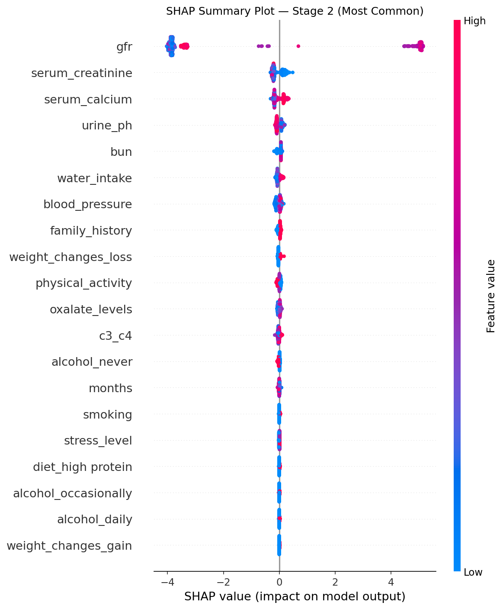
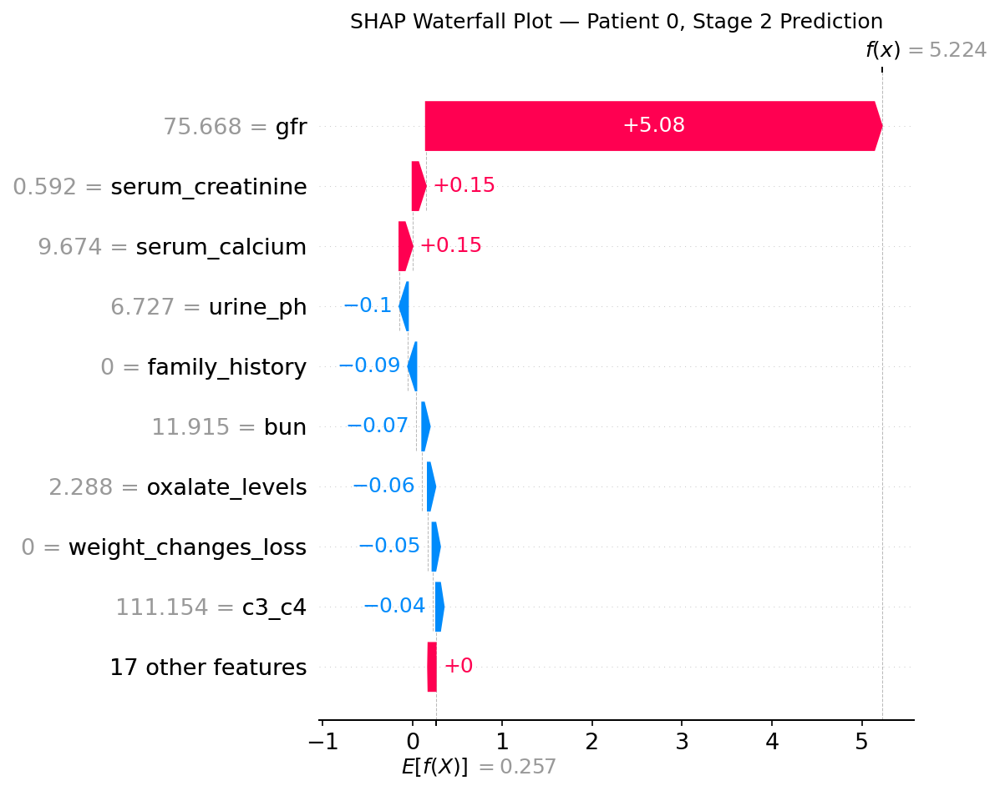

# 🫁 NephroSense — AI-Powered CKD Stage Prediction System

> A production-level Machine Learning system for early detection and staging of **Chronic Kidney Disease (CKD)** — built with SHAP explainability, Model Governance, A/B Testing, LLM-powered AI Analysis, and Auto Rollback with email alerting.

[](https://nephro-sense-nine.vercel.app)
[](https://nephrosense-production.up.railway.app)
[](https://nephrosense-production.up.railway.app/docs)
[](https://github.com/mushahidhussainleel/NephroSense)

---

## 📌 What is NephroSense?

NephroSense is a full-stack, production-deployed AI clinical decision support system. It accepts **26 patient clinical features** — lab results and lifestyle data — and predicts the **CKD stage (0–5)** using an XGBoost classifier.

Every prediction comes with:
- **SHAP-based explainability** — which features pushed the prediction, and by how much
- **LLM-generated AI Analysis** — Gemini 2.5 Flash explains the result in plain English
- **Stage-specific clinical advice** — urgency-aware recommendations per stage
- **Fallback mechanism** — if LLM is unavailable, predefined recommendations are shown

This system was built as a **junior ML engineering portfolio project** demonstrating production ML practices — not just model training.

---

## 🔗 Live Links

| Service | URL |
|---------|-----|
| 🌐 Frontend App | https://nephro-sense-nine.vercel.app |
| ⚙️ Backend API | https://nephrosense-production.up.railway.app |
| 📄 API Docs (Swagger) | https://nephrosense-production.up.railway.app/docs |
| 💻 GitHub Repository | https://github.com/mushahidhussainleel/NephroSense |

---

## ✅ Key Features

| Feature | Description |
|---------|-------------|
| 🔬 CKD Stage Prediction | Predicts Stage 0–5 from 26 patient features using XGBoost |
| 📊 SHAP Explainability | Per-prediction waterfall chart + top 5 contributing features |
| 🤖 LLM AI Analysis | Gemini 2.5 Flash explains prediction in simple English with advice |
| ⚖️ Model Governance | Champion (V2) vs Challenger (V3) framework with MLflow tracking |
| 🔄 A/B Testing | Compare both models on same patient data in real-time |
| 🚨 Auto Rollback | Automatic model rollback if confidence drops below 80% threshold |
| 📧 Email Alerts | Gmail SMTP alert sent on auto or manual rollback |
| 🛡️ Admin Panel | Switch model versions + manual rollback via API-key protected routes |
| 🔁 Fallback Mechanism | If LLM fails, predefined stage recommendations are shown |
| 🐳 Dockerized | Docker + Docker Compose ready for any cloud deployment |

---

## 🫁 CKD Stages Covered

| Stage | GFR Range | Description |
|-------|-----------|-------------|
| Stage 0 | Normal | Healthy — No CKD detected |
| Stage 1 | ≥ 90 | Mild — Kidney damage with normal filtering |
| Stage 2 | 60–89 | Mild-Moderate — Slight reduction in function |
| Stage 3 | 30–59 | Moderate — Noticeable reduction |
| Stage 4 | 15–29 | Severe — Significant damage, dialysis prep may begin |
| Stage 5 | < 15 | Kidney Failure — Immediate medical intervention required |

---

## 📈 Model Performance

| Version | Model | Accuracy | F1 Weighted | Role |
|---------|-------|----------|-------------|------|
| V1 | Random Forest Classifier | 98.12% | 97.88% | Baseline |
| V2 | XGBoost Classifier | **98.62%** | **98.61%** | ✅ Champion — Production |
| V3 | XGBoost Classifier (Tuned) | 98.50% | 98.49% | 🔵 Challenger — Staging |

> V2 is set as Champion due to higher accuracy and F1 score. V3 serves as the Challenger for A/B comparison.

---

## 🧠 How It Works — End-to-End Flow

```
Patient Data (26 features)
        ↓
Preprocessing + Encoding
        ↓
XGBoost Model (V2 Champion)
        ↓
CKD Stage Prediction (0–5)
        ↓
SHAP Values Calculated
        ↓
Top 5 Features → Gemini 2.5 Flash (LLM)
        ↓
AI Explanation + Clinical Advice
        ↓
Result Page (Stage + Confidence + Waterfall + AI Analysis)
```

---

## 🔄 Model Governance — Champion / Challenger

NephroSense implements a real **Model Governance** framework:

```
V2 XGBoost (Champion — Production)
    ↕  A/B Testing
V3 XGBoost Tuned (Challenger — Staging)
```

- **Auto Rollback** triggers if average confidence of last 10 predictions drops below **80%**
- On rollback: Gmail alert is sent automatically
- **Manual Rollback** available via Admin Panel (API key protected)
- All rollback events logged with timestamp and reason

---

## 📊 SHAP Analysis



NephroSense uses **SHAP (SHapley Additive exPlanations)** to explain every single prediction:

- **Summary Plot** — overall feature importance across all training data
- **Waterfall Plot** — per-patient breakdown showing exactly which features pushed the prediction



**Key Finding:** `GFR` is by far the most influential feature across all CKD stages, followed by `Serum Creatinine`, `Blood Pressure`, and `BUN`.

---

## 🤖 LLM Integration — Gemini 2.5 Flash

When a prediction is made, the **top 5 SHAP features** are sent to **Gemini 2.5 Flash** via Google's new `google-genai` SDK. The LLM generates a structured explanation in 4 sections:

1. **What Your Results Show** — plain English stage explanation
2. **Key Factors Explained** — top 3 features explained simply
3. **Immediate Advice** — urgency-aware (critical for Stage 4–5)
4. **See a Doctor** — nephrologist referral reminder

If the LLM API is unavailable, a **predefined fallback recommendation** is shown automatically. The frontend badge shows `Gemini 2.5 Flash` or `Predefined Response` accordingly.

---

## 🏗️ Tech Stack

| Layer | Technology |
|-------|-----------|
| ML Models | XGBoost, Scikit-learn, Random Forest |
| Explainability | SHAP (TreeExplainer) |
| LLM | Gemini 2.5 Flash (`google-genai` SDK) |
| Experiment Tracking | MLflow |
| Backend | FastAPI, Pydantic v2, Uvicorn |
| Frontend | HTML5, CSS3, Vanilla JavaScript |
| Containerization | Docker, Docker Compose |
| Backend Deployment | Railway |
| Frontend Deployment | Vercel |
| Email Alerts | Gmail SMTP |

---

## 📁 Project Structure

```
NephroSense/
│
├── .env
├── .gitignore
├── README.md
├── docker-compose.yml
│
├── backend/
│   ├── app/
│   │   ├── main.py              ← FastAPI app + CORS
│   │   ├── model_loader.py      ← Model loading + version management
│   │   ├── schemas.py           ← Pydantic schemas + STAGE_CONTEXT
│   │   └── routes/
│   │       ├── predict.py       ← /predict/explain endpoint
│   │       ├── llm_explain.py   ← Gemini 2.5 Flash integration
│   │       ├── versions.py      ← Model version management
│   │       ├── monitoring.py    ← Auto rollback + email alerts
│   │       └── ab_testing.py    ← A/B testing endpoint
│   │
│   ├── models/                  ← Trained .pkl model files
│   ├── assets/                  ← SHAP plots + confusion matrices
│   ├── notebooks/               ← EDA + training notebooks
│   ├── Dockerfile
│   └── requirements.txt
│
└── frontend/
    ├── index.html               ← 3-step prediction form
    ├── result.html              ← Prediction result + AI analysis
    ├── ab_test.html             ← A/B testing interface
    ├── admin.html               ← Admin panel
    ├── css/
    └── js/
        ├── api.js               ← All API calls
        ├── form.js              ← Form logic + validation
        └── result.js            ← Result rendering + LLM display
```

---

## 🔌 API Endpoints

### Public

| Method | Endpoint | Description |
|--------|----------|-------------|
| GET | `/` | Landing page |
| POST | `/predict/explain` | CKD prediction + SHAP + LLM explanation |
| GET | `/version` | Active model version |
| GET | `/metrics` | Request count + confidence metrics |
| POST | `/ab-test` | Compare V2 vs V3 on same patient data |

### Admin (API Key Required)

| Method | Endpoint | Description |
|--------|----------|-------------|
| GET | `/admin/versions` | All model versions + status |
| POST | `/admin/switch-version` | Switch active model |
| POST | `/admin/rollback` | Manual rollback |
| GET | `/admin/rollback-history` | Full rollback log |

---

## 🚀 Quick Start — Local Setup

```bash
# 1. Clone
git clone https://github.com/mushahidhussainleel/NephroSense.git
cd NephroSense

# 2. Create .env in backend/
NEPHROSENSE_ADMIN_KEY=your_secret_key
GEMINI_API_KEY=your_gemini_api_key
GMAIL_SENDER=your_gmail@gmail.com
GMAIL_APP_PASSWORD=your_app_password
ALERT_EMAIL=alert_recipient@gmail.com

# 3. Run with Docker
docker-compose up --build

# 4. Access
# Frontend: http://localhost
# Backend:  http://localhost:8000/docs
```

---

## 📓 Notebooks

| Notebook | What it covers |
|----------|----------------|
| `01_eda_and_preprocessing.ipynb` | Data exploration, missing value analysis, feature engineering, encoding |
| `02_model_training.ipynb` | V1/V2/V3 training, MLflow experiment tracking, SHAP analysis, confusion matrices |

---

## 🔒 Privacy & Compliance

NephroSense follows a **privacy-first design**:

- No patient data is stored permanently
- All predictions processed **in-memory only**
- Data cleared on session end
- HIPAA-aligned architecture (in-memory processing)

**Known Limitation:**
- Monitoring metrics reset on server restart
- Future improvement: SQLite for persistent monitoring

---

## 🔮 Future Improvements

- **Doctor Feedback Loop** — Track correct/incorrect predictions, use feedback for model retraining
- **Patient History** — Multiple predictions per patient for longitudinal monitoring
- **Authentication System** — Multi-doctor login, each doctor sees their own data
- **A/B Testing Persistence** — Save A/B results to database for long-term model comparison

---

## ⚠️ Disclaimer

> NephroSense is an AI/ML clinical decision support tool. All predictions must be verified by a qualified nephrologist. This system is **not a substitute** for professional medical advice.

---

## 👨‍💻 Developer

**Mushahid Hussain**
Junior ML Engineer | HopeToSkills Training Program

- 🐙 GitHub: [mushahidhussainleel](https://github.com/mushahidhussainleel)
- 💼 LinkedIn: [mushahid-hussain-dev](https://linkedin.com/in/mushahid-hussain-dev)
- 📧 Email: mushahidh442007@gmail.com